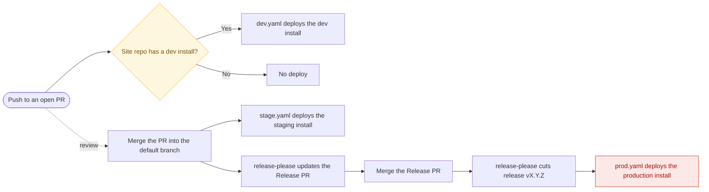
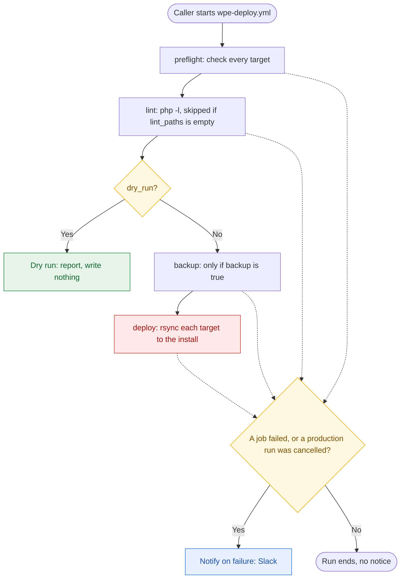

# Deploy a Site Repo to WP Engine with the Shared Workflows

> **Use when:** you set up or migrate how a 434 site repo deploys, or change a shared workflow here.
> **Time:** 10 min per site repo · **Who:** 434 developer or agent · **Risk:** high
> **Related:** [PR #15](https://github.com/434marketing/.github/pull/15), [deploy SOP](https://github.com/434marketing/wp-admin/blob/main/sops/DEPLOYMENT_SOP.md)
> **Source of record:** [`434marketing/.github/README.md`](https://github.com/434marketing/.github/blob/main/README.md)

## Overview

This repo, `434marketing/.github`, holds the shared workflows and templates that deploy
434 site repos to WP Engine. The v2 shared workflow, `wpe-deploy.yml`, deploys a theme,
plugin or mu-plugin to the dev, staging or production install. A pull request deploys to
the dev install, if the site repo has one. A merge deploys to staging, and a release
deploys to production. For the day-to-day steps from a pull request to production, use
the [deploy SOP](https://github.com/434marketing/wp-admin/blob/main/sops/DEPLOYMENT_SOP.md).



*Figure 1. The v2 deploy model. Each environment has its own trigger.*

> [!IMPORTANT]
> v2 is not proven yet. Nothing in v2 has run on GitHub or against a WP Engine install.
> The `v2` tag exists only after PR #15 and the v2.0.0 Release PR merge. The pilot is
> vsma-wp, with a dry run first. Migrate other site repos only after the pilot passes.

## Terms

This README uses each term below for one meaning only. The third column lists words that it does not use for that meaning.

| Term | Meaning | Do not write |
|---|---|---|
| site repo | The client's GitHub repository that holds one WordPress site's theme, plugins or mu-plugins. | client repo, project repo, calling repo |
| caller | A workflow in the site repo (`dev.yaml`, `stage.yaml`, `prod.yaml`, `release-please.yaml`) that calls a shared workflow. | calling workflow, wrapper |
| shared workflow | A reusable workflow in `434marketing/.github`: `wpe-deploy.yml`, and the v1 pair. | reusable deploy, org workflow |
| template | A file in `workflow-templates/` or `client-repo-templates/` that a site repo copies. | starter workflow |
| environment | One of `dev`, `staging`, `production`. It is also the name of the GitHub Environment that records each deploy. | env, tier, stage (as a noun for the environment) |
| install | The WP Engine install that serves one environment, for example `mysitestg`. WP Engine's API and SSH gateway use this word. | site (for an install), WP Engine environment, env |
| deploy | As a noun: one run that copies code from a site repo to an install. As a verb: to do that. | deployment (except in GitHub's own UI labels), push (for a deploy), ship |
| target | One `src_path` to `remote_path` pair. A deploy has 1 to 6 targets. | destination pair, entry |
| backup | A WP Engine on-demand backup taken before a deploy: a restore point. | snapshot, restore point (after this definition) |
| release | A version that release-please cuts: a `vX.Y.Z` tag, a GitHub Release and a `CHANGELOG.md` entry. | version bump, cut (as a noun) |
| Release PR | The pull request that release-please keeps open. Merging it cuts a release. | release pull request, version PR |
| preflight | The first job of `wpe-deploy.yml`. It refuses an unsafe deploy shape. | pre-flight, pre-check |
| default branch | The branch that the repository's settings name as default: `main`, `master` or `develop`. | trunk (except in quoted code), main (as a generic word) |
| dry run | A deploy with `dry_run: true`. It writes nothing. | rehearsal |
| action | `wpengine/github-action-wpe-site-deploy`, the WP Engine GitHub Action that the `deploy` job runs to do the rsync. Its code is in `wpengine/site-deploy`. | deploy action, WP Engine action |
| NOT YET LIVE gate | The commented `if:` line on the `plan` job in `prod.yaml`. When it is uncommented, production deploys only if `PROD_DEPLOY_ENABLED` is `true`, or for a dry run. | launch gate |
| `skip-deploy` label | A PR label. A merge of a PR that carries it does not deploy staging. | no-deploy label |

Product names keep their own spelling: WP Engine, GitHub, GitHub Actions, release-please,
rsync, WordPress, wp-cli, mu-plugin.

## The deploy model

Each environment has a different trigger, and no 2 triggers are the same event.

| Environment | Deploys when | Caller | Present in |
|---|---|---|---|
| `dev` | Every push to an open PR | `dev.yaml` | Only site repos that have a dev install, normally for an in-place rebuild |
| `staging` | A PR merges into the default branch, or a manual run from any branch | `stage.yaml` | Every site repo |
| `production` | The Release PR merges. release-please cuts the `vX.Y.Z` release and calls `prod.yaml` with it. A `vX.Y.Z` tag pushed by hand also deploys. | `release-please.yaml` and `prod.yaml` | Every site repo, gated off until launch |

In one sentence: **a pull request is dev, the default branch is staging, and a release
is production.** A branch is not an environment.

For the day-to-day steps (open a PR, merge, release, deploy again, roll back), use the
[deploy SOP](https://github.com/434marketing/wp-admin/blob/main/sops/DEPLOYMENT_SOP.md).

### What changed from v1, and why

v1 had 2 triggers, and each one deployed one step too early.

**v1: an open PR deployed to staging.** Every push to any open PR overwrote staging. With
2 open PRs, staging showed the PR that had the last push, and nothing said so.
**v2:** the PR environment is `dev`, and a merge deploys staging. In a site repo with no
dev install, a PR deploys nowhere. This is intentional: staging is no longer scratch
space.

**v1: a merge deployed straight to production, and chose the version after.**
`wpe-deploy-prod.yml` deployed on merge. Then it read `major`, `minor` or `patch` labels
from the PR to compute a tag. One merge both landed and published the code, and the
version was decided after the deploy. A forgotten label silently released a patch
version. **v2:** production deploys a release. The release comes from the Release PR,
which shows the exact version and changelog before anything deploys.

### Why release-please calls `prod.yaml`

A tag that `GITHUB_TOKEN` creates does not start other workflows. Only
`workflow_dispatch` and `repository_dispatch` are exempt from that rule. release-please
creates its tag with `GITHUB_TOKEN`, so a `push: tags` trigger in `prod.yaml` never fires
for it.

For this reason, `release-please.yaml` has a second job, `production`. It runs only when
release-please cuts a release, and it calls `prod.yaml` with the new tag through
`workflow_call`. This repo moves its own `v<major>` tag the same way.

`prod.yaml` keeps 2 more triggers: `push: tags` for a tag pushed by hand, and
`workflow_dispatch` to deploy an existing tag again. All 3 paths run the same `plan` job.
So the default-branch check and the `PROD_DEPLOY_ENABLED` gate apply to each path.

> [!IMPORTANT]
> No Release PR without `prod.yaml`. `release-please.yaml` needs `prod.yaml` in the same
> site repo. A `uses:` that points at a missing file fails the whole workflow at startup,
> Release PR included. On a site that is not live yet, add `prod.yaml` anyway and turn on
> its NOT YET LIVE gate (see [Set up a site repo](#set-up-a-site-repo)).

### Put a PR branch on staging

v2 keeps this option, as a decision instead of a side effect. Start `stage.yaml` by hand
from the branch:

```sh
gh workflow run stage.yaml --ref my-branch
```

Or click `Actions` > `Deploy to WP Engine Staging` > `Run workflow`, and select the
branch. `workflow_dispatch` runs the workflow from the ref you select, and the run
records who started it.

> [!WARNING]
> Staging stops being predictable. With the setting below, any push to any open PR
> deploys staging. If 2 people push, staging shows whichever push came last.

To get the v1 behaviour back in one site repo, widen one line in its `stage.yaml`. This
can suit a site repo with no dev install and one developer:

```yaml
on:
  pull_request:
    types: [closed, opened, synchronize, reopened]
```

The `plan` job already handles both event shapes, so this is the full change. When a run
starts from an open PR, it writes a warning to the run summary, so the choice stays
visible.

## Set up a site repo

Use this procedure for a new site repo. For a site repo that uses the v1 shared
workflows, use [Migrate a site repo from v1](#migrate-a-site-repo-from-v1) instead.

### Before you start

- [ ] PR #15 and the v2.0.0 Release PR are merged, and the `v2` tag exists. Check with `git ls-remote --tags https://github.com/434marketing/.github v2`.
- [ ] The vsma-wp pilot has passed. Until then, set up only vsma-wp.
- [ ] You have admin access to the site repo.
- [ ] You know the install names: staging, production, and dev if the site has one.
- [ ] The organization has the secrets `WPE_SSHG_KEY_PRIVATE`, `WPE_API_USER_ID` and `WPE_API_PASSWORD`, and the variable `BACKUP_NOTIFICATION_EMAIL`.

### Procedure

#### 1. Set the repository settings

1. Turn on `Settings` > `Actions` > `General` > `Allow GitHub Actions to create and approve pull requests`.
   - **Result:** release-please can open its Release PR.
2. Create the `skip-deploy` label:

   ```sh
   gh label create skip-deploy --color BFD4F2 --description "Merge without deploying"
   ```

   `stage.yaml` reads this label. A merged PR that carries it does not deploy staging.
3. Set the squash commit to the PR title, with an empty body:

   ```sh
   gh api -X PATCH repos/434marketing/<site repo> \
     -f squash_merge_commit_title=PR_TITLE -f squash_merge_commit_message=BLANK
   ```

   - **Result:** `gh api repos/434marketing/<site repo> --jq .squash_merge_commit_title` prints `PR_TITLE`.
4. If you restrict the `production` environment to some branches or tags, allow the default branch and `v*` tags.

Why the squash setting: release-please reads the commit subject and body. GitHub's
default gives a PR with 1 commit that commit's message as its subject, not the PR title.
An empty body keeps the PR description out of release-please, so a paragraph in it
cannot cut a release.

A release deploys from the release-please run on the default branch. A tag pushed by
hand deploys from the tag. So the `production` environment must allow both.

#### 2. Set the variables

> [!WARNING]
> Empty install name. If you set these variables on a GitHub Environment, they arrive
> empty. Set them at repository or organization level.

1. Add the repository variable `WPE_STAGE_ENV` with the staging install name.
2. Add the repository variable `WPE_PROD_ENV` with the production install name.
3. If the site has a dev install, add the repository variable `WPE_DEV_ENV` with its name.
   - **Result:** the site repo needs nothing more. `WPE_SSHG_KEY_PRIVATE`,
     `WPE_API_USER_ID`, `WPE_API_PASSWORD` and `BACKUP_NOTIFICATION_EMAIL` live at
     organization level.

Why not on a GitHub Environment: the callers read `WPE_*_ENV` in `with:`. The backup job
reads `BACKUP_NOTIFICATION_EMAIL` before any job that declares an environment starts.

#### 3. Add the callers

> [!TIP]
> You can also copy the callers from `workflow-templates/` in this repo.

1. Create a branch in the site repo for the setup files.
2. In the site repo, open `Actions` > `New workflow`.
3. Find the `By 434marketing` section.
4. Add `stage.yaml` to your branch.
5. Add `release-please.yaml` and `prod.yaml` together.
6. If the site has a dev install, add `dev.yaml`.
7. In each caller, replace `THEME_NAME` with the theme folder name.
8. If you deploy a plugin, use the matching commented block instead of the theme block.
9. If you deploy an mu-plugin or another shape, see [Deploy shapes](#deploy-shapes).
10. Keep the `What to deploy` block the same in `dev.yaml`, `stage.yaml` and `prod.yaml`.
    - **Result:** no other edits are necessary. The templates find the default branch
      themselves, so `main`, `master` and `develop` all work as copied.

> [!CAUTION]
> Public site change. If the site is not live yet and you skip the next step, the first
> release deploys to the production install.

11. If the site is not live yet, uncomment the `if:` line on the `plan` job in `prod.yaml`.
    - **Result:** the line reads `if: vars.PROD_DEPLOY_ENABLED == 'true' || inputs.dry_run`.
      A release cut before launch cannot deploy, but a dry run can. Leave
      `PROD_DEPLOY_ENABLED` unset until launch day. The
      [deploy SOP](https://github.com/434marketing/wp-admin/blob/main/sops/DEPLOYMENT_SOP.md#4-cut-a-release)
      has the launch-day steps.

#### 4. Add the release-please files

`release-please.yaml` needs 3 files that a workflow template cannot carry. Run the
commands in this phase from the site repo root.

1. Clone this repo next to the site repo:

   ```sh
   gh repo clone 434marketing/.github ../434marketing-github
   ```

2. Copy the 3 files from `client-repo-templates/` into the site repo:

   ```sh
   mkdir -p .github
   cp ../434marketing-github/client-repo-templates/release-please-config.json    .github/
   cp ../434marketing-github/client-repo-templates/.release-please-manifest.json .github/
   cp ../434marketing-github/client-repo-templates/VERSION                       .github/
   ```

3. In `.github/release-please-config.json`, replace `REPO_NAME` with the repository name.
4. In `extra-files`, set the path of the file that holds the `Version:` header.
5. Wrap the `Version:` header in release-please markers. See [The `Version:` header needs markers](#the-version-header-needs-markers).
6. If the site repo has `vX.Y.Z` tags, do steps 1 to 5 of [Repos that already have release tags](#repos-that-already-have-release-tags).
   - **Result:** the manifest and `.github/VERSION` hold the version of the newest tag.

#### 5. Merge the setup files

1. Open a PR from your branch into the default branch.
   - **Result:** if the site repo has `dev.yaml`, the PR deploys to the dev install.
2. Put the `skip-deploy` label on the PR.
3. Merge the PR.
   - **Result:** the `Deploy to WP Engine Staging` run skips the deploy, so staging does not change.

#### 6. Do a dry run

A dry run runs preflight and lint, resolves the install name through the WP Engine API,
and writes nothing. Only a dry run shows, before a real deploy, that a credential pair
cannot see an install. It also shows if preflight refuses the deploy shape.

1. Start a staging dry run on the default branch:

   ```sh
   gh workflow run stage.yaml --ref <default-branch> -f dry_run=true
   ```

   - **Result:** the `Dry run` job summary shows the install name `resolved to` an id.
2. If the site repo has a release tag, start a production dry run with it:

   ```sh
   gh workflow run prod.yaml -f tag=v1.4.2 -f dry_run=true
   ```

   - **Result:** the same summary for the production install. The NOT YET LIVE gate
     lets a dry run through, so this works before launch.

### Verify

- [ ] The staging dry run summary shows the install `resolved to` an id, not `NOT FOUND.`
- [ ] The first Release PR's diff changes the `Version:` header file and `.github/VERSION`.
- [ ] After the first merge without `skip-deploy`, the `staging` environment in GitHub shows a deploy.

> [!NOTE]
> `github-actions[bot]` opens the Release PR. In a site repo with `dev.yaml`, its
> pull-request run waits for `Approve workflows to run`. Leave it unapproved. The Release
> PR changes only the changelog and version files.

## Migrate a site repo from v1

Nothing breaks until you do this. `@v1` keeps working. Plan about 10 minutes per site repo.

### Before you start

- [ ] PR #15 and the v2.0.0 Release PR are merged, and the `v2` tag exists.
- [ ] The vsma-wp pilot has passed.
- [ ] You have admin access to the site repo.
- [ ] You know the site repo's newest `vX.Y.Z` tag.

### Procedure

#### 1. Set the repository settings and variables

v1 site repos never ran release-please, so the setting that lets it open a Release PR
is normally off.

1. Do [1. Set the repository settings](#1-set-the-repository-settings) from the setup procedure.
   - **Result:** release-please can open a Release PR, the squash commit takes the PR
     title, and the `skip-deploy` label exists.
2. If the site has a dev install, add the repository variable `WPE_DEV_ENV` with its name.
   - **Result:** `dev.yaml` has an install name when the migration PR opens.

#### 2. Prepare one migration PR

> [!IMPORTANT]
> Production cannot deploy if these files land apart. `release-please.yaml` calls
> `prod.yaml`, and a v1 `prod.yaml` has no `workflow_call` trigger. Put steps 2 to 8 in one PR.

1. Create a branch in the site repo.
2. Do [4. Add the release-please files](#4-add-the-release-please-files) from the setup procedure.
   - **Result:** the manifest and `.github/VERSION` hold the newest v1 tag's version.
3. Add `release-please.yaml` from the template.
4. Replace `prod.yaml` with the v2 template.
5. Replace `stage.yaml` with the v2 template.
6. If the site has a dev install, add `dev.yaml`.

> [!NOTE]
> If the v1 `theme_path` has no trailing `/`, add one. Preflight refuses a directory
> `src_path` without it.

7. In the `What to deploy` block of each caller, set `src_path` to the v1 `theme_path` value.
8. In the same block, set `remote_path` to the v1 `remote_path` value.
   - **Result:** all callers have the same `src_path`, `remote_path` and `lint_paths`.
9. Put the `skip-deploy` label on the PR.
10. Tell the people who work in the site repo that staging now deploys on merge, not on a PR update.
11. Merge the PR.
    - **Result:** the `Deploy to WP Engine Staging` run skips the deploy.

#### 3. Check the manifest after the merge

The v1 shared workflow `wpe-deploy-prod.yml` tags every merge. If it tags the migration
PR, the manifest is behind again.

1. Find the newest tag: `git fetch --tags && git tag -l 'v*' --sort=-v:refname | head -1`.
2. If that tag is newer than the manifest, set the manifest and `.github/VERSION` to it.
   - **Result:** the `Refuse a manifest that is behind the tags` step in
     `release-please.yaml` passes. If you forget, it fails and says so.

#### 4. Dry run and verify

1. Start a staging dry run: `gh workflow run stage.yaml --ref <default-branch> -f dry_run=true`.
   - **Result:** the `Dry run` job summary shows the install `resolved to` an id.
2. Open a throwaway PR whose title starts with `fix:`.
   - **Result:** it deploys to dev, or nowhere if the site repo has no `dev.yaml`.
3. Merge the throwaway PR.
   - **Result:** staging updates, and release-please opens a Release PR.
4. Start a production dry run: `gh workflow run prod.yaml -f tag=<newest tag> -f dry_run=true`.
   - **Result:** the `Dry run` job summary shows the install `resolved to` an id.

> [!CAUTION]
> Public site change. Merging the Release PR deploys production. Merge it only when the
> default branch is ready to release.

5. Merge the Release PR.
   - **Result:** the same release-please run shows a `production` job that deploys the new tag.

#### 5. Remove the v1 settings

1. Delete the `major`, `minor` and `patch` labels from the site repo.
   - **Result:** `gh label list` shows no `major`, `minor` or `patch` label.
2. Remove the `WPE_INSTALL_ID` secret. v2 finds each install id from the install name.

### Rollback

1. If you deleted the `major`, `minor` and `patch` labels, create them again.
2. If you removed `WPE_INSTALL_ID`, add it again.
3. Open a revert PR with the `Revert` button on the merged migration PR.
4. If the reverted callers use `@main`, change each `uses:` line in the revert PR to `@v1`.

> [!CAUTION]
> Production deploy. The revert restores the v1 `prod.yaml`, which deploys production
> when a PR merges. So this merge deploys production and cuts a v1 tag. Merge only when
> the default branch is safe to release.

5. Merge the revert PR.
   - **Result:** the v1 callers run again.

The v1 shared workflows at `@v1` stay unchanged, so the reverted callers work as before.

## `wpe-deploy.yml` reference

One shared workflow deploys every environment, and themes, plugins and mu-plugins alike.
Only the configuration differs between dev, staging and production. So the differences
are inputs, not 3 files that someone must keep in step by hand.

```yaml
jobs:
  deploy:
    uses: 434marketing/.github/.github/workflows/wpe-deploy.yml@v2
    with:
      wpe_env: ${{ vars.WPE_STAGE_ENV }}
      src_path: themes/my-theme/
      remote_path: wp-content/themes/my-theme/
      lint_paths: themes/my-theme
      environment: staging
      backup: true
    secrets: inherit
```

### Inputs

| Input | Required | Default | Notes |
|---|---|---|---|
| `wpe_env` | Yes | None | Install **name**, not id. |
| `environment` | Yes | None | `dev`, `staging` or `production`. GitHub creates it on first use. It gives the deploy history and the option of a required reviewer. |
| `src_path` | Yes, or `targets` | None | A directory ends with `/`, and its contents are copied. `./` is a repo whose root is the plugin. A single file is allowed. |
| `remote_path` | Yes, or `targets` | None | One folder: `wp-content/{plugins,themes,mu-plugins}/<slug>/`. For a file: the destination file. |
| `targets` | No | None | JSON list of `{src_path, remote_path}`. Deploys in order after one lint and one backup. Replaces the 2 inputs above. Max 6. |
| `allow_unsafe_remote_path` | No | `false` | The only bypass of the one-folder rule. Warns on every run. |
| `ref` | No | The caller's ref | On a merged `pull_request`, pass the merge commit. Preflight resolves it to one commit. |
| `version` | No | `<branch>@<short-sha>` | A **label for the backup**, never a release version. |
| `backup` | No | `false` | Request a backup before the deploy. |
| `backup_required` | No | `false` | No backup, no deploy. `true` for production. |
| `backup_wait` | No | `false` | Wait for `completed`. A 202 means *requested*. |
| `lint_paths` | No | `.` | Space-separated `php -l` paths. Empty turns the lint gate off. `.` lints the whole repo, so **set it** in a repo that holds more than the deployed code. |
| `php_version` | No | `8.2` | Match the install. Also the PHP for `setup_composer`. |
| `php_versions` | No | None | JSON list, for example `["7.4","8.4"]`. Lints once per version. Overrides `php_version` for lint. |
| `rsync_flags` | No | See [rsync flags](#rsync-flags) | Replaces the whole string when set. |
| `extra_excludes` | No | None | Space-separated patterns, added as `--exclude=<p>`. Keeps the defaults. |
| `build_command` | No | None | Runs from the repo root before the rsync, for example `composer install --no-dev`. |
| `setup_node` | No | None | Node version for `build_command`, for example `20`. |
| `setup_composer` | No | `false` | PHP and Composer for `build_command`. |
| `post_deploy_script` | No | None | Script on the install, run after the last target. See [Post-deploy checks](#post-deploy-checks). |
| `smoke_wp_cli` | No | `false` | `wp eval` on the install after the deploy. Any fatal fails the run. |
| `require_active_plugin` | No | None | Slug that must be active after the deploy. |
| `smoke_urls` | No | None | Space-separated paths fetched after the deploy. A non-2xx fails the run. |
| `cache_clear` | No | `true` | Flush page and CDN cache once, after the last target. |
| `dry_run` | No | `false` | Preflight, lint, resolve the install, write nothing. |

### Secrets and variables

| Name | Kind | When | Notes |
|---|---|---|---|
| `WPE_SSHG_KEY_PRIVATE` | Secret | Always | SSH key for the WP Engine SSH gateway. |
| `WPE_API_USER_ID` | Secret | `backup: true`, and the install lookup of a dry run | WP Engine API user. |
| `WPE_API_PASSWORD` | Secret | `backup: true`, and the install lookup of a dry run | WP Engine API password. |
| `BACKUP_NOTIFICATION_EMAIL` | **Variable** | `backup: true` | Required by the WP Engine backup endpoint. |
| `SLACK_WEBHOOK_URL` | Secret | Optional | Posts when a deploy fails, and when a production deploy is cancelled. |

`notification_emails` is a *required* field on the WP Engine backup endpoint. So the
backup job stops with `No backup` when `BACKUP_NOTIFICATION_EMAIL` is not set. A
misspelled variable name counts as not set.

A production deploy that someone cancels also posts to Slack, because a cancellation
during a deploy is exactly when someone needs to look.

**There is no `WPE_INSTALL_ID`, and that is intentional.** The v1 shared workflow
`wpe-deploy-prod.yml` kept the install's UUID as a secret. An install id belongs to one install, so a repo could hold
only one. That is why v1 could back up production but never staging.

`wpe-deploy.yml` finds the id from the install *name* through `GET /installs`. So one
organization-level credential pair covers every install in every site repo. If API
access is not turned on for the account, it sees no installs at all. A dry run finds
this before a deploy needs it.

If the WP Engine API returns an error during that lookup, the run reports an error,
never "not found". On staging (`backup_required: false`), it warns instead of blocking
the deploy.

### Jobs

Each job starts only when every job before it succeeded or was skipped on purpose. A
cancelled run never reaches the rsync.



*Figure 2. The jobs of `wpe-deploy.yml`. A dry run stops after lint. Notify runs on a failure, or on a cancelled production run that is not a dry run.*

| Job | Runs when |
|---|---|
| `preflight` | Always. It checks every target and pins the run to one commit. |
| `lint` | `lint_paths` is not empty. One job per PHP version. |
| `backup` | `backup: true`, not a dry run, and preflight and lint passed or lint was skipped. |
| `deploy` | Not a dry run, and every earlier job passed or was skipped. |
| `dry-run-report` | `dry_run: true`, and preflight and lint passed or lint was skipped. |
| `notify-failure` | A job failed, or a production deploy that is not a dry run was cancelled. |

**The run deploys one commit.** Preflight resolves `ref` to a SHA. Lint, the backup
label and the deploy all use that SHA. So a branch that moves during a 30-minute
production backup wait cannot put a different commit into the rsync.

**A required reviewer pauses the run after the backup.** Only the deploy job declares the
`environment`. The backup is still valid for the code, because nothing has changed the
code yet. But database and upload changes made while the approval waits
are not in it. Approve promptly, or run the deploy again to take a new backup.

### Preflight: what it refuses

The action, `wpengine/github-action-wpe-site-deploy`, protects a site with one exclude
list. Its static part applies to every
deploy: `wp-config.php`, `_wpeprivate`, `.wpengine-conf/` and VCS files.

The other part guards `uploads/`, caches, drop-ins and 12 named WP Engine mu-plugins. The
action generates it only when `REMOTE_PATH` is *exactly* `''`, `.`, `wp-content(/)` or
`wp-content/mu-plugins(/)`. Nothing in it limits `--delete`.

Each deploy below exited rsync with 0, a green deploy, when reproduced against the
action's own code:

| `src_path` to `remote_path` | What happened |
|---|---|
| `plugins/lyh-welcome/` to `wp-content/plugins/` (slug forgotten) | Deleted every other plugin, and left this plugin's files loose at the plugins root. |
| `plugins/` to `wp-content/plugins/` | Deleted every plugin not in git, and overwrote live third-party plugins with older git copies. |
| `plugins/lyh-welcome` to `wp-content/plugins/lyh-welcome/` (no trailing slash) | Deployed into `lyh-welcome/lyh-welcome/`. The old plugin kept running. |

So the preflight job checks every target before lint and backup. The deploy job checks
again after the build, against the tree that it deploys. Preflight fails the run when:

1. `remote_path` starts with `/` or `./`, or contains `//`, a `.` segment or a `..`
   segment. The action's protections are an exact string match, so a non-standard
   spelling silently turns them off.
2. `src_path` does not exist in the commit that deploys.
3. `src_path` is a directory without a trailing `/`, so rsync would nest it 1 level too
   deep. Or `src_path` is a file, and `remote_path` is not a file with the same name.
4. The flags contain `--delete`, and `remote_path` is a shared root:
   - For the site root, `wp-content/` and `wp-content/uploads/`, nothing makes it safe.
     Deploy one folder, or remove `--delete`.
   - For `wp-content/plugins/`, `themes/` or `mu-plugins/`, a root deploy needs
     `--filter='P /*'` in `rsync_flags` *and* `allow_unsafe_remote_path: true`. Put the
     filter before any include, `R` rule or rules file.
5. A directory deploy targets anything except **one** folder,
   `wp-content/{plugins,themes,mu-plugins}/<slug>/`. Or a file deploy lands outside those
   3 directories. `allow_unsafe_remote_path: true` allows both, with a warning on every
   run.
6. `src_path` looks 1 level too high, so it is almost always the wrong `src_path`.
   Preflight checks 3 signs:
   - `src_path` contains a folder with the destination slug, as
     `mu-plugins/` to `wp-content/mu-plugins/lyh-core/` would.
   - A `wp-content/plugins/<slug>/` folder has no `*.php` file directly in it with a
     non-empty `Plugin Name:` header.
   - A `wp-content/themes/<slug>/` folder has no `style.css` with `Theme Name:`.
7. A single `.php` file deploys, and `lint_paths` does not cover it. The action's own
   `PHP_LINT` runs `find "$SRC_PATH"/`. For a file, that finds nothing and still prints
   success. So the lint job is the only lint that file gets.

Why `P /*` cannot make the site root or `wp-content/` safe: it keeps every top-level
entry from deletion, but only 1 level deep. Each plugin, theme and upload 1 level
down would still go. rsync applies the first rule that matches, so an earlier include
overrides the filter.

Preflight also rejects:

- `--delete-excluded`. It deletes the files that the action's excludes protect.
- `--inplace` (or `--append`) together with `--delay-updates`. rsync refuses the pair.
  `--inplace` alone gets a warning.
- `--relative` (`-R`) and `--files-from`. They move or replace the source.
- 2 targets with the same destination, and nested targets under `--delete`.
- A word in `rsync_flags` that is not an option. See [rsync flags](#rsync-flags).
- An empty `rsync_flags`, and an `extra_excludes` pattern with a quote or backslash.
- An empty `wpe_env`, which means a `WPE_*_ENV` variable is not set.
- A malformed `targets`, `php_versions`, `post_deploy_script`, `require_active_plugin` or
  `smoke_urls` value.

It warns when an mu-plugin loader comes before its folder in `targets`.

With `build_command` set, preflight cannot check a `src_path` that the build creates.
Preflight then applies every rule that depends only on `remote_path`. The second check,
after the build, does the rest.

### Deploy shapes

Each shape below is one `with:` block. The templates carry the plugin and multi-target
examples next to `THEME_NAME`.

#### A plugin in a subfolder

```yaml
      src_path: plugins/lyh-welcome/
      remote_path: wp-content/plugins/lyh-welcome/
      lint_paths: plugins/lyh-welcome
```

#### A repo whose root is the plugin

Use `./` for this shape. Exclude what must not deploy. A pattern that starts with `/`
matches only at the top of `src_path`, so a vendored `vendor/foo/README.md` still deploys:

```yaml
      src_path: ./
      remote_path: wp-content/plugins/lyh-welcome/
      lint_paths: .
      extra_excludes: /README.md /CHANGELOG.md /docs/ /tests/ /phpunit.xml.dist
```

#### An mu-plugin

An mu-plugin is 2 targets: first the folder, then the loader as a single file. Never
deploy the `mu-plugins/` root. Preflight refuses it under `--delete`.

> [!CAUTION]
> Other mu-plugins deleted. A root deploy keeps only the 12 WP Engine mu-plugins that the
> action's exclude list names. It deletes every other mu-plugin on the server: client and
> vendor ones, and any WP Engine mu-plugin newer than that list.

```yaml
      targets: >-
        [{"src_path": "mu-plugins/lyh-core/",
          "remote_path": "wp-content/mu-plugins/lyh-core/"},
         {"src_path": "mu-plugins/lyh-core-loader.php",
          "remote_path": "wp-content/mu-plugins/lyh-core-loader.php"}]
      lint_paths: mu-plugins
```

The folder goes first because WordPress runs every top-level
`wp-content/mu-plugins/*.php` on every request. A loader that lands before its code
causes a fatal error on the whole site.

An mu-plugin fatal is worse than a plugin fatal: **WordPress recovery mode does not cover
mu-plugins.** Guard the loader, so a missing folder degrades the site instead of
stopping it:

```php
<?php
// wp-content/mu-plugins/lyh-core-loader.php
if ( is_readable( __DIR__ . '/lyh-core/lyh-core.php' ) ) {
	require_once __DIR__ . '/lyh-core/lyh-core.php';
}
```

#### Several targets in one deploy

One lint pass and **one** backup run first. Then the targets deploy one after another in
array order, and the deploy stops at the first failure. The cache flushes once, after the
last target.

3 separate callers would mean 3 backups (each up to 30 minutes on production), 3 cache
flushes and no order.

```yaml
      targets: >-
        [{"src_path": "themes/lyh/",            "remote_path": "wp-content/themes/lyh/"},
         {"src_path": "plugins/lyh-welcome/",   "remote_path": "wp-content/plugins/lyh-welcome/"},
         {"src_path": "mu-plugins/lyh-core/",   "remote_path": "wp-content/mu-plugins/lyh-core/"},
         {"src_path": "mu-plugins/lyh-core-loader.php",
          "remote_path": "wp-content/mu-plugins/lyh-core-loader.php"}]
      lint_paths: themes/lyh plugins/lyh-welcome mu-plugins
```

#### A plugin with a build step

CI deploys a *checkout*. Anything that git ignores (`vendor/`, `build/`, compiled
assets) is not in it, and `--delete` removes the server's copy.

> [!CAUTION]
> Runtime files deleted. If a plugin has git-ignored runtime dependencies, build them in
> the deploy job, or remove `--delete` from `rsync_flags`.

```yaml
      src_path: plugins/lyh-welcome/
      remote_path: wp-content/plugins/lyh-welcome/
      setup_composer: true
      setup_node: "20"
      build_command: >-
        cd plugins/lyh-welcome && composer install --no-dev --optimize-autoloader
        && npm ci && npm run build
```

The build runs in the deploy job, after checkout and before the rsync, so the built tree
is what deploys. Preflight runs again after the build. The lint job lints the source, not
the build output. `node_modules` and `package.json` are in the default excludes, but
`vendor/` is not.

#### A plugin with a PHP support floor

`php_versions: '["7.4","8.4"]'` lints against each version in parallel.

### Post-deploy checks

`php -l` cannot see a runtime fatal: a missing class, a bad `require_once`, or a function
that does not exist on the install's PHP. A plugin fatal breaks the front end, and an
mu-plugin fatal has no recovery mode. Without a check, the run is green either way.

All 4 checks are opt-in. They run after the last target, so a failure reaches the Slack
notice.

| Input | What it does |
|---|---|
| `smoke_wp_cli: true` | Runs `wp eval 'echo "ok";'` over the SSH gateway. That loads WordPress with every active plugin, mu-plugin and the theme, so any fatal in them fails the run. |
| `require_active_plugin: lyh-welcome` | `wp plugin is-active lyh-welcome` must succeed. |
| `smoke_urls: "/ /wp-login.php"` | Fetches each path from `https://<install>.wpenginepowered.com` and follows redirects. Retries a 5xx 2 times. Anything except a final 2xx fails. |
| `post_deploy_script: wp-content/plugins/lyh-welcome/bin/post-deploy.sh` | Runs the script with `bash` on the install, from the site root, after the rsync. A non-zero exit fails the run. |

```yaml
      smoke_wp_cli: true
      require_active_plugin: lyh-welcome
      smoke_urls: "/ /wp-login.php"
```

> [!WARNING]
> The bad code is already live when a check fails. These checks run after the deploy. Fix
> forward, or deploy the previous release again: `gh workflow run prod.yaml -f tag=vX.Y.Z`.

Notes:

- `smoke_wp_cli` uses the install's **CLI** PHP, which is its *configured* version. During
  a PHP Test Driver session, the install's web server can serve a different version. Only
  `smoke_urls` tests that one.
- The wp-cli checks send their script over stdin to `bash -s`. The WP Engine SSH gateway
  strips quotes from a command line. So the same commands, passed as an `ssh` argument,
  arrive broken.
- A password-protected install answers `smoke_urls` with a 401. Do not use `smoke_urls`
  there.
- `post_deploy_script` must be a path **inside a deployed folder**, given from the site
  root, so this deploy's rsync refreshes it. Preflight checks both.

Why `post_deploy_script` must be inside a deployed folder: the action uploads the script
only when it is *missing* on the server. `entrypoint.sh` tests `test -s` and an
uninitialised `status`. So the action itself never updates a script that already exists
there.

### Plugin lifecycle

- **The first deploy does not activate the plugin.** Run `wp plugin activate <slug>` once
  per install. On multisite, add `--network`.
- **A renamed main file or folder silently deactivates the plugin.** WordPress stores the
  active plugin as `folder/file.php`. Set `require_active_plugin`, so the deploy fails
  instead.
- **To remove a plugin,** run `wp plugin deactivate <slug> && wp plugin delete <slug>` on
  each install *before* you delete the caller. If you remove the caller, the plugin stays on
  the server, and nothing else ever deletes it.

### rsync flags

The default is:

```text
-azvr --delete --delay-updates --delete-delay --exclude=.* --exclude=node_modules
--exclude=package.json --exclude=package-lock.json --exclude=yarn.lock
--exclude=vite.config.js --exclude=webpack.mix.js --exclude=gulpfile.js
--exclude=postcss.config.js
```

Write every option as `--name=value`. Preflight rejects a word in `rsync_flags` that is
not an option, because rsync would read it as one more *source* and deploy it too. For
example, `--exclude=foo bar` merges a folder named `bar` into the plugin, and the run is
green.

Preflight also rejects an empty `rsync_flags`. The action would silently replace it with
its own default, which has `--inplace`.

Whatever `rsync_flags` says, the action **always appends** 2 more flags after it:
`--exclude-from=<its generated list>` and `--chmod=D775,F664` (`entrypoint.sh` in
`wpengine/site-deploy`). The generated list is the WP Engine protection described under
[Preflight](#preflight-what-it-refuses). It applies only to the exact `REMOTE_PATH`
spellings listed there.

The default differs from the action's own default (`-azvr --inplace --exclude=".*"`) in
3 ways. Each one is intentional.

#### `--delete` is added

The action's default never deletes. So a file removed from git stays on the install
forever, and the deploy still reports success.

WordPress finds page templates with a regex scan of theme PHP files *on disk*. So a
deleted template still appears in the block editor's `Template` panel. If it is a
high-priority match like `front-page.php`, it still *serves* pages.

**Preflight is what limits `--delete`.** It holds every directory deploy to one plugin,
theme or mu-plugin folder. The action does not limit it.

#### `--inplace` is removed

Without `--inplace`, rsync replaces each file atomically. The flag was copied around the
fleet without review. It is in the action's default, so it was in both v1 workflows and
in the action's own README example.

`--inplace` writes incoming bytes straight into the live destination file. It skips
rsync's default: build a temporary file in the destination directory, then `rename()` it
over the target when complete. A `rename()` in the same directory is atomic. So under the
default, a concurrent reader gets the whole old file or the whole new one.

rsync's manual, on `--inplace`:

> The file's data will be in an inconsistent state during the transfer and will be
> left that way if the transfer is interrupted or if an update fails.

A live WordPress site is a standard example of an in-use file set. WordPress reads
`functions.php`, each plugin's main file and every template from disk on each request.
So a request inside that window compiles a truncated or mixed file, and fails with a
fatal error.

WP Engine has `display_errors` off, so the result is a blank page. Its only explanation
is the install's error log. Opcache does not help: a revalidation inside the window can
compile the broken file and serve it until the next mtime change. And `--inplace`
implies `--partial`, so an interrupted or cancelled run *leaves* the broken bytes in
place.

The `--inplace` fix reached every `@v1` site repo in **v1.1.3** (#16).

#### `--delay-updates --delete-delay` are added

Atomic files alone still let a new plugin main file go live before the new file it loads
with `require_once`. Every request in that window fails with a fatal error. A test
reproduced this.

With these 2 flags, each updated file waits in a `.~tmp~` holding directory. At the
**end** of the transfer, rsync renames all of them into place in one burst. Deletions
happen after that.

**The limit:** each file is atomic, and all updates apply together at the end of the
transfer. But that burst of renames is not one atomic act, so a request can still land
between 2 of them. In a 3,000-file test run, 1,653 files were still waiting when the
first one went live. Only a build directory plus a symlink swap makes a whole deploy
atomic, and the action cannot do that.

#### What an interrupted deploy leaves

A test reproduced this with the action's own code and rsync 3.4.3. It stopped each end
with SIGTERM or SIGKILL. In every case the live files stayed exactly as they were, and
nothing was deleted. Beyond that:

- **If the deploying side stops** (a cancelled run, a dropped connection), the folder
  keeps a `.~tmp~/` holding directory. It holds the finished new files and the one that
  was in transfer. The next successful deploy of the same or a later commit normally
  removes it.
- **If a file in `.~tmp~/` was later deleted from git,** the holding directory stays,
  because rsync protects it from `--delete`. Remove it by hand.
- **If the server-side rsync itself stops,** the file in transfer stays as a stray
  `.name.XXXXXX` dotfile in the live directory. `--exclude=.*` shields it from
  `--delete`, so remove it by hand.

Compare the action's default: an interrupted `--inplace` run left the live file matching
neither the old nor the new version, with earlier files already new.

#### Excludes

To add an exclude, use `extra_excludes`, not a full `rsync_flags`. The defaults then stay
as they are:

```yaml
      extra_excludes: /README.md /CHANGELOG.md /docs/
```

- A leading `/` anchors a pattern to the top of `src_path`. Without it, `README.md` would
  also drop every vendored `vendor/*/README.md`.
- An exclude also **shields** the server's copy from `--delete`. The deploy neither
  updates nor removes an excluded path.
- Git-ignored files never deploy, whatever the excludes say, because CI deploys a
  checkout.

#### Dotfiles

**Dotfiles never deploy, and never update.** Because of `--exclude=.*`, a
`.htaccess` or `.well-known/` in the plugin never reaches the server. A stale server copy
is neither updated nor removed.

To deploy a dotfile, give the full `rsync_flags` with an include **before**
`--exclude=.*`. rsync uses the first rule that matches:

```yaml
      rsync_flags: >-
        -azvr --delete --delay-updates --delete-delay
        --include=/.htaccess --exclude=.*
        --exclude=node_modules --exclude=package.json --exclude=package-lock.json
        --exclude=yarn.lock --exclude=vite.config.js --exclude=webpack.mix.js
        --exclude=gulpfile.js --exclude=postcss.config.js
```

### What this workflow does not do

- **Tag, or cut a GitHub Release.** release-please in the site repo owns versions. If the
  deploy also decided the version, nobody could review the release before it deploys.
- **Read `major`, `minor` or `patch` labels.** Version numbers come from commit messages.
  See [Versioning a site repo](#versioning-a-site-repo).
- **Activate plugins, run content migrations or flush rewrite rules.** Neither the action
  nor this workflow touches the database. Those stay manual.

## Versioning a site repo

Site repos use release-please for versions, the same way this repo does:

1. A merged PR's **title is a conventional commit**. With the squash setting from
   [Set up a site repo](#1-set-the-repository-settings), a squash merge makes that title
   the commit subject. release-please reads the commit subject and body.
2. release-please keeps one open Release PR titled `chore(<default-branch>): release X.Y.Z`,
   for example `chore(main): release 1.4.3`. It shows the version and changelog that it
   will write.
3. When you merge the Release PR, release-please writes `CHANGELOG.md`, sets the new
   version and creates the `vX.Y.Z` tag.
4. The same run then calls `prod.yaml` with that tag, which deploys production.

The [deploy SOP](https://github.com/434marketing/wp-admin/blob/main/sops/DEPLOYMENT_SOP.md)
has the steps to cut a release.

### Which titles cut a release

Verified per type against the site repo config (`client-repo-templates/release-please-config.json`):

| Title | Effect |
|---|---|
| `feat:` | MINOR |
| `fix:`, `docs:`, `perf:`, `deps:`, `refactor:`, `revert:` | PATCH |
| `!` before the colon, or a `BREAKING CHANGE:` footer, with any type, hidden or not | MAJOR |
| `chore:`, `ci:`, `build:`, `test:`, `style:` | No release |
| A type the config does not list (`wip:`, `feature:`), or a title that is not a conventional commit (`Update style.css`, GitHub's default `Revert "…"`) | No release, and no changelog line |

> [!WARNING]
> Silent MINOR. `feature:` cuts nothing on its own. But next to a visible commit, it
> makes the release a MINOR, and it does not appear in the changelog. Write `feat:`.

A `Release-As: 1.5.0` footer forces an exact version, whatever the type.

The first release of a new site repo is `1.0.0`, not `0.1.0`. With no earlier release,
release-please skips the bump rules and returns `initial-version`. For release-type
`simple`, that is `1.0.0`.

### The `Version:` header needs markers

If you only list a file in `extra-files`, release-please does **not** change a theme's or
plugin's `Version:` header.

release-please gives a string `extra-files` entry a format-specific updater only for
`.json`, `.yaml`/`.yml`, `.toml` and `.xml`. Any other file, such as `.css` or `.php`,
gets the `Generic` updater. It changes only these lines:

- lines that carry `x-release-please-version`
- lines between `x-release-please-start-version` and `x-release-please-end`

A header without markers never changes.

Put the markers on **their own lines**, around the `Version:` line **only**:

- WordPress's `get_file_data()` reads a header to the end of its line. A marker on the
  `Version:` line shows in `Appearance` > `Themes` as part of the version, for example
  `1.3.0 x-release-please-version`. This was checked against WordPress.
- Inside a start/end block, the updater changes the first version-like string on
  *every* line. A block that also covers `Tested up to: 6.4.2` changes that to the
  release version too.

```css
/*
Theme Name: LYH
x-release-please-start-version
Version: 1.2.3
x-release-please-end
*/
```

```php
<?php
/**
 * Plugin Name:       LYH Welcome
 * x-release-please-start-version
 * Version:           1.2.3
 * x-release-please-end
 */

define( 'LYH_WELCOME_VERSION', '1.2.3' ); // x-release-please-version
```

An inline marker is safe on a PHP constant, where nothing reads the rest of the line.
With markers in place, the version that WordPress shows matches the tag. That is also
why the release commit is worth a staging deploy.

The template config lists `themes/THEME_NAME/style.css`. For a plugin, list its main file
instead, or as well. `extra-files` takes several paths:

```json
"extra-files": ["themes/THEME_NAME/style.css", "plugins/PLUGIN_SLUG/PLUGIN_SLUG.php"]
```

This example is here and not in the template, because release-please reads its config
with plain `JSON.parse`. A comment in that file fails the run.

> [!WARNING]
> No error for a wrong path. If a path does not exist (`THEME_NAME` not edited, or
> `VERSION` not copied), release-please only logs a warning and skips the file. Check
> that the first Release PR's diff changes the header file and `.github/VERSION`.

### Versioning in a mixed repo

Sometimes the deployed plugin is one folder in a repo that holds other things. Then scope
release-please to that folder, so only commits that touch it count:

```json
{
  "release-type": "simple",
  "include-v-in-tag": true,
  "packages": {
    "plugins/lyh-welcome": {
      "include-component-in-tag": false,
      "changelog-path": "CHANGELOG.md",
      "version-file": "VERSION",
      "extra-files": ["lyh-welcome.php"]
    }
  }
}
```

Set `.github/.release-please-manifest.json` to `{ "plugins/lyh-welcome": "1.2.3" }`.

The example shows only what changes. Keep everything else from the template config,
especially `changelog-sections`. Without it, release-please uses its own defaults. They
hide `docs` and `refactor` and drop `deps`, so those types stop cutting releases.

The template's `release-please.yaml` reads the package's prefixed outputs
(`plugins/lyh-welcome--tag_name`) itself, so it needs no edit.

- Only commits that touch a file under `plugins/lyh-welcome/` count toward its version
  and changelog. A `feat:` that touches only the theme, or a sibling folder such as
  `plugins/lyh-welcome-pro/`, does not count.
- `changelog-path`, `version-file` and `extra-files` resolve **relative to the package
  folder**. Start a path with `/` to make it relative to the repo root. The package needs
  its own `VERSION` file.
- `include-component-in-tag: false` keeps the tags as `vX.Y.Z`, which `prod.yaml` deploys.
  If it is `true`, or misspelled, the tag becomes `<component>-vX.Y.Z`, and `prod.yaml`
  refuses it. release-please silently ignores an unknown key.

### Repos that already have release tags

Every site repo that ran the v1 shared workflow `wpe-deploy-prod.yml` has `vX.Y.Z` tags
and GitHub Releases. With the template manifest (`0.0.0`) unchanged, release-please
proposes `1.0.0`, a version that already exists, with the whole history in its changelog.
The first step of `release-please.yaml` refuses to run in that state, and points here.

> [!WARNING]
> Wrong first version. Do **not** use `bootstrap-sha` or `initial-version` for this. The
> first still proposes `1.0.0`. The second ignores `feat` and `fix` and lists the whole
> history again.

1. Find the newest tag: `git fetch --tags && git tag -l 'v*' --sort=-v:refname | head -1`.
2. Set `.github/.release-please-manifest.json` to that version without the `v`, for example `{ ".": "1.4.2" }`.
3. Set `.github/VERSION` to the same version, for example `1.4.2`.
4. Run `git merge-base --is-ancestor v1.4.2 origin/<default-branch>`.
   - **Result:** exit code 0 means the tag's commit is in the default branch's history.
5. If the command fails, set the top-level `"last-release-sha"` to the output of `git rev-list -n1 v1.4.2`.
   - **Result:** the changelog starts after `v1.4.2`. Without it, the changelog lists all
     history again.
6. If a v1 `prod.yaml` exists, replace it with the v2 template in the PR for steps 2 to 5.
7. After the PR merges, do step 1 again.
8. If there is a newer tag, update the manifest to it before you merge any Release PR.
   - **Result:** the first Release PR proposes the next version, for example `1.4.3` or
     `1.5.0`. It lists only the commits since `v1.4.2`.

Why step 6 and step 7: `wpe-deploy-prod.yml` tags every merge. If it tags this PR, the
manifest is behind again. The guard step says so if you forget.

release-please finds `v1.4.2` by its tag name. So the Release that v1 created, or a bare
tag, is enough.

The other release mechanics are the same as for this repo. These are which types release
and why, how to re-title a dependabot PR, and the phantom-commit trap in PR descriptions.
See [Cut a release of this repo](#cut-a-release-of-this-repo).

## Troubleshooting

| Symptom | Cause | Action |
|---|---|---|
| Preflight: `wpe_env '' is not a WP Engine install name` | The `WPE_*_ENV` variable is not set, or is set on a GitHub Environment. | Set it at repository or organization level. |
| `No backup`: `BACKUP_NOTIFICATION_EMAIL is not set`. An error on production, a warning on staging. | The variable is not set, or is set under the old wrong name `BACKUP_EMAIL_NOTIFICATION`. | Set the organization variable `BACKUP_NOTIFICATION_EMAIL`. Remove `BACKUP_EMAIL_NOTIFICATION`. |
| `No backup`: `WP Engine returned HTTP 400 for the backup request` | WP Engine refused the request. The log line before the error shows its message. | Read the message. Check the addresses in `BACKUP_NOTIFICATION_EMAIL`. |
| Dry run: API lookup `NOT FOUND.` | The API credentials cannot see the install, or API access is off for the account. | Check the install name. Turn on API access in the WP Engine User Portal. |
| Dry run: API lookup `LOOKUP FAILED.` | The WP Engine API returned an error or a non-JSON body. | Read the run log. Run the dry run again later. |
| Dry run: API lookup `not checked (no API credentials)` | The API secrets are not visible to the site repo. | Check the repository access of the organization secrets `WPE_API_USER_ID` and `WPE_API_PASSWORD`. |
| `release-please.yaml` fails at startup | `prod.yaml` is missing from the site repo. | Add `prod.yaml`. If the site is not live, turn on its NOT YET LIVE gate. |
| `release-please failed` with a permissions error | `Allow GitHub Actions to create and approve pull requests` is off, or the job has no `issues: write`. | Turn on the setting in `Settings` > `Actions` > `General`. Keep the template's `permissions`. |
| `Manifest is behind the tags` | The manifest is older than the newest `vX.Y.Z` tag. | Do [Repos that already have release tags](#repos-that-already-have-release-tags). |
| No Release PR appears | Every commit since the last release has a hidden type, such as `chore:`. | Land the next change with `fix:` or `feat:`, or add a `Release-As:` footer. |
| A release is cut, but production does not deploy | The NOT YET LIVE gate is on, and `PROD_DEPLOY_ENABLED` is not `true`. | Set `PROD_DEPLOY_ENABLED` to `true`. Then deploy the release: `gh workflow run prod.yaml -f tag=vX.Y.Z`. |
| `prod.yaml`: `Not a release tag` | The tag is not `vX.Y.Z`, for example `v1.2.3-rc.1` or `<component>-vX.Y.Z`. | Deploy a `vX.Y.Z` tag. In a mixed repo, set `include-component-in-tag: false`. |
| `prod.yaml`: `Tag is not on the default branch` | The tag was cut on a feature branch, or moved later. | Merge the work, let staging deploy it, and tag from the default branch. |
| `Cannot pick one release` | release-please cut more than one tag in one run. | Deploy each tag with `prod.yaml`'s `Run workflow`. |
| The theme's `Version:` does not change | The header has no release-please markers. | Add markers. See [The `Version:` header needs markers](#the-version-header-needs-markers). |
| WordPress shows `1.3.0 x-release-please-version` | The marker is on the `Version:` line. | Move the markers to their own lines. |
| A plugin is inactive after a deploy | The main file or folder was renamed. | Activate it with `wp plugin activate <slug>`. Set `require_active_plugin`. |
| A `.~tmp~/` folder stays in a plugin folder | An interrupted deploy, and a file in it was later deleted from git. | Remove the folder by hand. |
| A stray `.name.XXXXXX` dotfile in a live folder | The server-side rsync stopped during a deploy. | Remove the file by hand. |
| `smoke_urls` fails with 401 | The install is password-protected. | Remove `smoke_urls` for that install. |
| The Release PR's dev run waits for `Approve workflows to run` | `github-actions[bot]` opened the PR. | Leave it unapproved. |

## v1 shared workflows

`wpe-deploy-staging.yml` and `wpe-deploy-prod.yml` are the v1 shared workflows. They are
deprecated. They receive no new features. Their interface stays the same, so nothing
pinned to `@v1` breaks. To move a site repo to v2, use
[Migrate a site repo from v1](#migrate-a-site-repo-from-v1).

| | `wpe-deploy-staging.yml` | `wpe-deploy-prod.yml` |
|---|---|---|
| Inputs | `theme_path`, `remote_path` | Same |
| Secrets | `WPE_SSHG_KEY_PRIVATE` | Also `WPE_API_USER_ID`, `WPE_API_PASSWORD`, `WPE_INSTALL_ID` |
| Variables | `WPE_STAGE_ENV` | `WPE_PROD_ENV`, `BACKUP_NOTIFICATION_EMAIL` |
| Also does | None | Tags and releases the site repo from `major`, `minor` or `patch` PR labels |

> [!NOTE]
> The variable is `BACKUP_NOTIFICATION_EMAIL`. Until v2, this README said
> `BACKUP_EMAIL_NOTIFICATION`, but the workflow always read the first name (fixed in
> `08d0020`). If you set the name this README used to give, unset it.

On 2026-10-08, 14 site repos called the v1 shared workflows: 9 at `@main` and 5 at
`@v1`. kbc inlines its own copy and is not counted. No site repo used v2 yet.

| Reference | Site repos |
|---|---|
| `@main` (9) | Infinite-Hero-Foundation, community-access-network, flylyh, impact-services, lyh-museum, lynchburg-eda, noble-warriors, soar-ministry-coaching, warrior-fellowship |
| `@v1` (5) | center-for-early-success, dodson-pest-control, home-in-him, institute-for-advanced-learning-and-research-ialr, sbcv |

`@main` is never correct. See [References](#references).

## Maintain this repo

This section is about `434marketing/.github` itself. For a site repo, see
[Versioning a site repo](#versioning-a-site-repo).

### References

Site repos reference these workflows **by tag, never by branch**. `v2` is current. `v1`
is still published and still receives fixes.

| Reference | Behaviour | Use when |
|---|---|---|
| `@v2` | **Default.** Tracks the newest `v2.x.y`. Fixes and features arrive automatically. Breaking changes never do. | Almost always |
| `@v1` | Same contract, previous major. Fixes only. | A site repo that is not migrated yet |
| `@v2.1.3` | Frozen at one release. Nothing reaches the site repo until someone changes it by hand. | A site repo in the middle of a migration, or a byte-reproducible deploy |
| `@main` | Tracks every commit as it lands. | Never. Tags replaced this. |

### What counts as a breaking change

| Change | Meaning |
|---|---|
| **MAJOR** (`v3`) | Renamed or removed inputs, a new required secret or variable, or any change that could break a site that works today |
| **MINOR** (`v2.x`) | New optional inputs, a new capability, or a changed default that is safe for every site |
| **PATCH** (`v2.0.x`) | Bug fixes with no interface change |

Site repos on `@v2` get MINOR and PATCH releases **automatically**. That is the purpose
of the floating tag. But it sets the bar for MAJOR: *could this break a site that works
today*, not *does this feel like a big change*. If in doubt, cut a major.

### Cut a release of this repo

Releases are automatic. Never tag this repo by hand.

[`release-please.yml`](.github/workflows/release-please.yml) runs on every push to `main`.
It keeps **one open Release PR** that collects the pending changes and shows the version
they will cut.

The merge of that PR is the release. It writes `CHANGELOG.md`, updates
[`.github/VERSION`](.github/VERSION), and creates the `vX.Y.Z` tag and the GitHub Release.
Then it force-moves the matching `v<major>` tag to the new release.

1. Merge a PR into `main` with a **conventional commit title**. See [Write the title](#write-the-title).
2. When you want to release, merge the Release PR.
   - **Result:** the workflow does everything else.

`main` allows only squash and rebase merges, and squash is the normal path. So the **PR
title becomes the commit message**, and release-please reads only that title.
[`pr-title-lint.yml`](.github/workflows/pr-title-lint.yml) rejects a PR whose title does
not parse. Its check summary tells you which release the title will cause.

#### Write the title

| Title | Release | Reaches `@v2` site repos |
|---|---|---|
| `feat!: require a WPE_INSTALL_ID secret` | MAJOR, `v3.0.0` | **Never.** Each site repo must change its `uses:` line. |
| `feat: add an optional php_lint input` | MINOR, `v2.1.0` | Automatically |
| `fix: correct the rsync exclude for lockfiles` | PATCH, `v2.0.1` | Automatically |
| `deps: bump actions/checkout from 6 to 7` | PATCH | Automatically |
| `docs:`, `perf:`, `refactor:`, `revert:` | PATCH | Automatically |
| `chore:`, `ci:`, `build:`, `test:`, `style:` | **None** | Never. The change stays on `main`. |

A `!` before the colon, or a `BREAKING CHANGE:` footer, cuts a major. Use the test from
[What counts as a breaking change](#what-counts-as-a-breaking-change): *could this break
a site that works today*, not *does this feel big*.

#### Which types release, and why

release-please's rule is not "only `feat` and `fix` release". The rule is: **a type
releases if that type is visible in `changelog-sections`.**

If every commit in a window has a hidden type, the release notes are empty, and
release-please skips the release
([`base.ts`](https://github.com/googleapis/release-please/blob/main/src/strategies/base.ts),
`changelogEmpty`). A visible type that is not `feat` and not breaking becomes a patch.

So the hidden list in [`.github/release-please-config.json`](.github/release-please-config.json)
*is* the release policy. With it, **the `v<major>` tag moves when what runs or what is
documented changes**, and not otherwise. `chore` is hidden on purpose. A tidied comment
must not cut a release that reaches every site repo on `@v2`.

> [!WARNING]
> A change that reaches nobody. A real behaviour change titled `chore:` cuts no release
> and appears in no changelog. It stays on `main`. If a change alters what the workflows
> *do*, title it `fix:` or `feat:`.

`pr-title-lint.yml` warns about this on the PR, but it cannot know your intent.

One exception: a **breaking marker overrides the hidden list**. `determineReleaseType`
checks `commit.breaking` *before* it looks at the type. The changelog's BREAKING CHANGES
section comes from commit notes, not from the type sections. So `chore!: …` cuts a
MAJOR, hidden or not.

#### Re-title a dependabot PR

Dependabot always proposes `deps:`, which is a patch. If that is wrong, change the PR
title before you merge. The squash commit takes the title, so that is the only edit
necessary.

| You want | Re-title to | Notes |
|---|---|---|
| PATCH | Keep the title | The default, and correct for almost every dependency update |
| MAJOR | `deps!: …` or `deps(github-actions)!: …` | `!` goes **after** the scope, before the colon. `deps!(): …` is not valid, and the lint rejects it. |
| MINOR | `feat(deps): …` | The only way. See below. |

There is no `deps` minor. Only the literal types `feat` and `feature` produce one
(`versioning-strategies/default.ts`), and no config option changes that. The other
option is a `Release-As:` footer in the PR description. It forces an exact version, and
release-please checks it before anything else.

In practice, a dependency update alone is almost never a MINOR. It adds no input, secret
or capability to *this* repo's interface, so it is a PATCH. If it could break a site,
it is a MAJOR. It is a MINOR only when you also change a workflow to expose something
that the new version made possible. That is your own `feat:` PR, with the update in it.

#### The PR description is part of the commit message

This repo squash-merges with `Pull request title and description`. So the description
becomes the body of the commit on `main`, and release-please parses that body, not only
the title.

That is why the `Release-As:` footer works. It also means a PR description can create a
**phantom commit** by accident. release-please splits one commit message into several
wherever a blank line comes directly before a conventional-commit prefix
([`commit.ts`](https://github.com/googleapis/release-please/blob/main/src/commit.ts),
`splitMessages`):

```text
feat|fix|docs|style|refactor|perf|test|build|ci|chore|revert
```

Many PRs in this repo are *about* versions. So a description like this one cuts a MINOR
from a docs-only PR, because the second paragraph parses as a real commit:

<pre>
Explains the release types.

feat: add an optional php_lint input
</pre>

> [!CAUTION]
> Unwanted release. Never start a paragraph in a PR description with `type: `. Put every
> example in a fenced code block, a table cell or inline backticks.

A fence works because the line above it is not blank. The same rule applies to a
`BREAKING CHANGE:` footer. It cuts a MAJOR from any PR whose description has one at the
start of a line.

`deps` is *not* in the split list, so a `deps: …` example in a description is harmless.

#### If something goes wrong

| Symptom | Cause | Action |
|---|---|---|
| No Release PR appears | Every commit since the last release has a hidden type, usually `chore:` or `ci:` on a change that needed `fix:`. Check the workflow's run summary. | Land the next change with a type that releases, or force one with `Release-As:`. |
| `v1` or `v2` points at the wrong commit | The major tag did not move, or moved wrong. | Run [`update-major-tag.yml`](.github/workflows/update-major-tag.yml) from `Actions` > `Update major version tag` > `Run workflow`, or with `gh workflow run update-major-tag.yml -R 434marketing/.github -f tag=vX.Y.Z`. Give it the `vX.Y.Z` tag that the major must point at. It finds the major from that tag, so it repairs either one. |
| A version must be forced | None | Add a `Release-As: 1.4.0` footer to a commit on `main`. |

#### Configuration

| File | Purpose |
|---|---|
| [`.github/release-please-config.json`](.github/release-please-config.json) | Bump rules and changelog sections |
| [`.github/.release-please-manifest.json`](.github/.release-please-manifest.json) | Current version. **release-please owns this file. Do not edit it by hand.** |
| [`.github/VERSION`](.github/VERSION) | The same version as plain text, for people and for `grep` |

`last-release-sha` in the config pins the start of history to the `v1.1.0` commit. So
release-please never scans the commits from before automation (`Initial commit`,
`Update Readme`, and so on). Leave it.

### Migrate to a new major

Breaking changes go into the next major. They reach nobody until each site repo changes
its `uses:` line. Keep fixes going to the previous major for a period, so site repos do
not have to migrate on a deadline they did not choose.

`v1` is in that period now. The per-repo steps are in
[Migrate a site repo from v1](#migrate-a-site-repo-from-v1).

### A note on trust

Every site repo passes `secrets: inherit`. So these workflows receive that site repo's
`WPE_SSHG_KEY_PRIVATE` and WP Engine API credentials.

> [!CAUTION]
> Fleet-wide credential exposure. Anyone who can merge here, or move a `v<major>` tag, can
> reach the deploy credentials of every 434 site. Do not relax the `main` rules for
> convenience.

That is why `main` requires a PR and an approving review.

For a site repo where even that is too much trust, pin to a full commit SHA. Someone can
move a tag, but nobody can move a SHA. Find the SHA of a `v2.x.y` release with
`git rev-list -n1 v2.x.y`, and put it in the `uses:` line:

```yaml
uses: 434marketing/.github/.github/workflows/wpe-deploy.yml@<40-character SHA of a v2.x.y release commit>
```

## Change log

| Date | Change | By |
|---|---|---|
| 2026-10-08 | Rewritten to the 434 technical doc standard for v2 | Adam + Claude |
